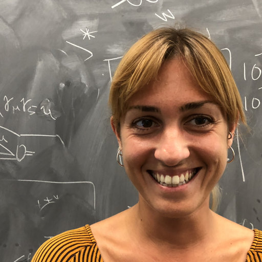 [Noemi Rocco](https://inspirehep.net/authors/1280460): PI - Associate Scientist, FNAL

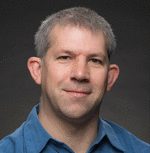 [John Campbell](https://inspirehep.net/authors/1014644): Senior Scientist, FNAL

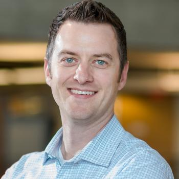 [J. Taylor Childers](http://www.jtchilders.com): Computational Scientist, ANL

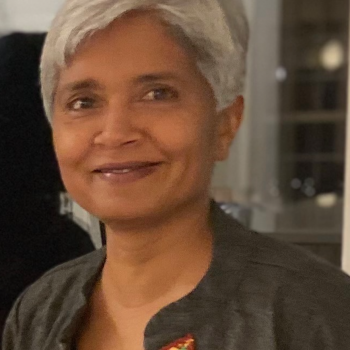 [Anshu Dubey](https://www.anl.gov/profile/anshu-dubey): ANL PI - Computational Scientist, ANL

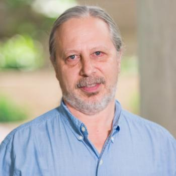 [Carlo Graziani](https://www.anl.gov/profile/carlo-j-graziani):  Computational Scientist, ANL

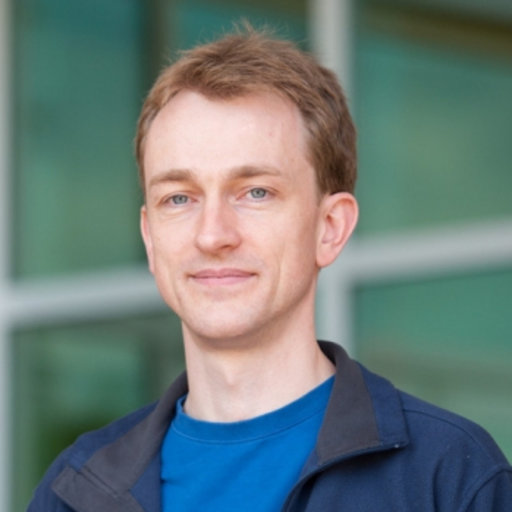 [Stefan Höche](http://www.freacafe.de): Senior Scientist, FNAL

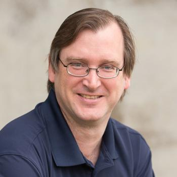 [Paul Hovland](https://www.anl.gov/profile/paul-hovland): Senior Computer Scientist, ANL

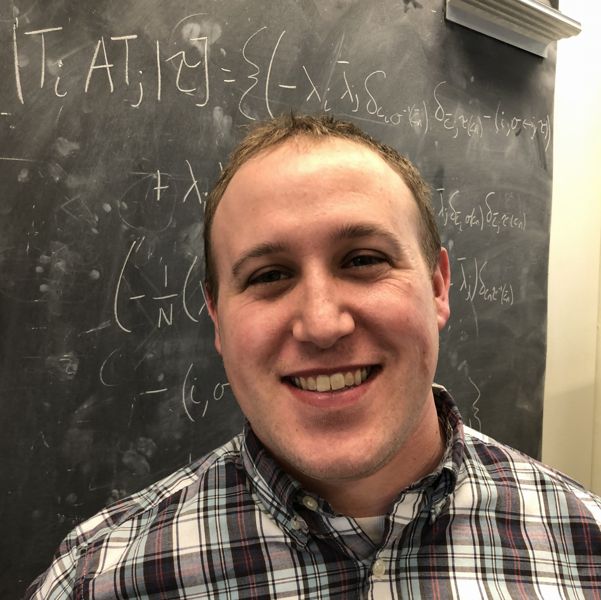 [Joshua Isaacson](https://inspirehep.net/authors/1410753): Research Associate, FNAL

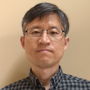 [Seyong Lee](https://ft.ornl.gov/~lees2/): ORNL PI - Senior Computer Scientist, ORNL

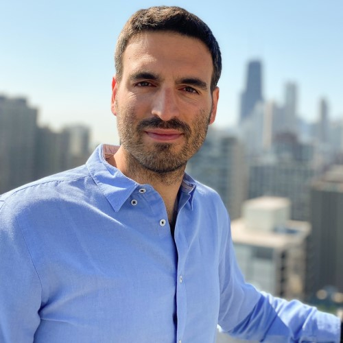 [Alessandro Lovato](https://www.anl.gov/profile/alessandro-lovato): Physicist, ANL

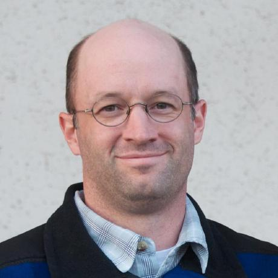 [Jared O'Neal](https://www.anl.gov/profile/jared-p-o-neal): Software Development Specialist, ANL

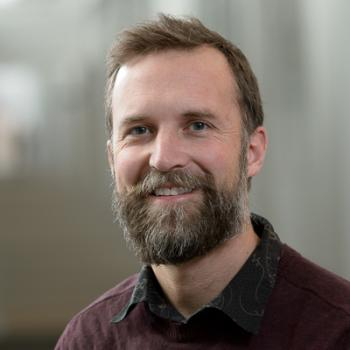 [Stefan M. Wild](https://wildsm.github.io/): Senior Computational Mathematician, ANL
